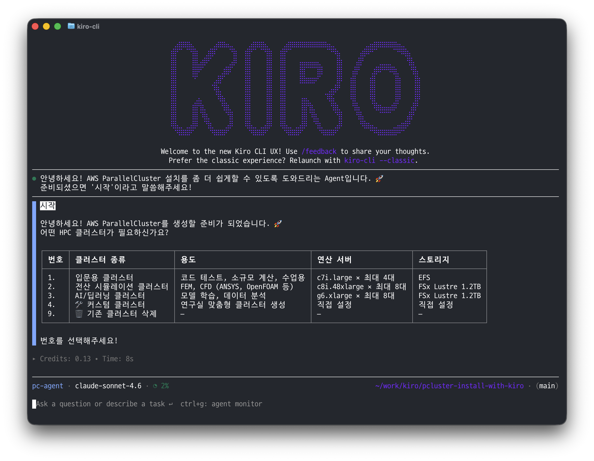

# pcluster-install-with-kiro

Kiro와 한국어로 대화하면서 AWS ParallelCluster(HPC 클러스터)를 쉽게 배포할 수 있는 프로젝트입니다.

## 왜 만들었나요?

대학 연구실에서 HPC 클러스터가 필요할 때, AWS 콘솔을 직접 다루거나 복잡한 CLI 명령어를 익히는 건 연구자에게 부담입니다.

Kiro에게 "시작"이라고 말하면, 복잡한 IT 명령어 없이도 간단한 선택만으로 약 30분 만에 네트워크부터 클러스터까지 구성할 수 있습니다. 미사용시엔 부담없이 삭제해서 비용을 절감하고 필요 시 다시 만들 수 있습니다.

> 💡 **필요할 때 만들고 → 쓰고 → 바로 삭제.** 이 사이클을 부담 없이 반복할 수 있습니다.



## 주요 특징

- 3종 프리셋(입문/시뮬레이션/AI) + 커스텀 모드로 번호 선택만으로 구성 가능
- 연산 인스턴스가 지원되는 가용영역(AZ)만 자동 필터링하여 배포 실패 방지
- CloudFormation으로 VPC/서브넷 자동 생성, 기존 VPC 재사용도 지원
- 검증된 템플릿의 변수를 치환하는 방식으로 LLM 할루시네이션 최소화
- 모든 단계에 용도별 추천과 예시를 제공하여 AWS 지식 없이도 선택 가능
- 생성부터 삭제까지 완전한 라이프사이클 관리 (네트워크 스택 정리 포함)

## 대상 사용자

- 대학 연구실 연구자 (본인 AWS 계정 사용)
- AWS/Shell 경험이 적은 비개발자

## 사전 준비

- AWS 계정 및 자격증명 설정 (`aws configure`)
- [Kiro CLI](https://kiro.dev) 설치
- Python 3.9 이상

## 사용 방법

1. 이 저장소를 클론합니다:
   ```bash
   git clone https://github.com/icn-univ/pcluster-install-with-kiro.git
   cd pcluster-install-with-kiro
   ```

2. Kiro CLI를 실행합니다:
   ```bash
   kiro-cli chat
   ```

3. pc-agent로 전환합니다:
   ```
   /agent swap pc-agent
   ```

4. "시작"이라고 입력하면 Kiro가 자동으로 클러스터 프리셋 안내를 시작합니다:
   ```
   1. 입문용 클러스터 — 코드 테스트, 소규모 병렬 계산
   2. 전산 시뮬레이션 클러스터 — FEM, CFD (ANSYS, OpenFOAM 등)
   3. AI/딥러닝 클러스터 — 모델 학습, 데이터 분석
   4. 🛠️ 커스텀 클러스터 — 직접 설정
   9. 🗑️ 기존 생성된 클러스터 삭제
   ```

5. 클러스터 이름을 입력하면 Kiro가 6단계로 자동 배포합니다:
   - AWS 계정 연결 확인
   - pcluster CLI 설치 확인
   - SSH 접속 키 확인
   - 네트워크 생성 (VPC/서브넷)
   - 클러스터 설정 파일 생성
   - 클러스터 배포

## 프로젝트 구조

```
├── .kiro/agents/
│   └── pc-agent.json          # Kiro agent 설정 (실행 진입점)
├── .kiro/steering/
│   └── hpc-installer.md       # Kiro 동작 지침 (핵심 steering 파일)
├── sample-vpc-subnet.json     # VPC/서브넷 CloudFormation 템플릿
├── sample-hpc-cluster.yaml    # 클러스터 설정 템플릿 (변수 치환 방식)
└── README.md
```

- `sample-vpc-subnet.json` — 네트워크 생성에 사용되는 CloudFormation 템플릿. 새 VPC 생성 또는 기존 VPC 재사용을 지원합니다.
- `sample-hpc-cluster.yaml` — ParallelCluster 설정 템플릿. 프리셋/커스텀 선택에 따라 변수가 치환되어 최종 config.yaml이 생성됩니다.

## 프리셋 클러스터

| # | 이름 | 용도 | 관리 서버 | 연산 서버 | 공유 저장소 |
|---|------|------|-----------|-----------|------------|
| 1 | 입문용 | 코드 테스트, 수업용 | t3.medium | c7i.large × 최대 4대 | EFS |
| 2 | 전산 시뮬레이션 | FEM, CFD | c7i.xlarge | c8i.48xlarge × 최대 8대 | FSx Lustre 1.2TB |
| 3 | AI/딥러닝 | 모델 학습, 데이터 분석 | c7i.xlarge | g6.xlarge × 최대 8대 | FSx Lustre 1.2TB |

## 커스텀 클러스터

4번(커스텀)을 선택하면 아래 항목을 직접 설정할 수 있습니다:

1. 클러스터 이름
2. 운영체제 선택
3. 관리 서버(Head Node) 인스턴스 타입
4. 연산 서버(Compute Node) 인스턴스 타입 — 용도별 추천 제공
5. 연산 서버 최대 수
6. 공유 스토리지 (EFS / FSx for Lustre)
7. 고속 네트워크 EFA (노드 간 병렬 통신)
8. 원격 데스크톱 DCV (웹 브라우저 GUI 접속)

## 클러스터 삭제

⚠️ 사용이 끝나면 반드시 클러스터를 삭제하세요. (비용 발생 방지)

```bash
pcluster delete-cluster --cluster-name <클러스터명> --region <리전>
```

## 참고 자료

- [HPC on AWS Hands-On for AWS ParallelCluster](https://catalog.us-east-1.prod.workshops.aws/workshops/f2b80cb7-e073-4226-9256-41c3d68129c4/en-US)
- [AWS HPC Workshop - Introduction to AWS ParallelCluster](https://catalog.workshops.aws/pcluster-intro/en-US)

## 라이선스

MIT
